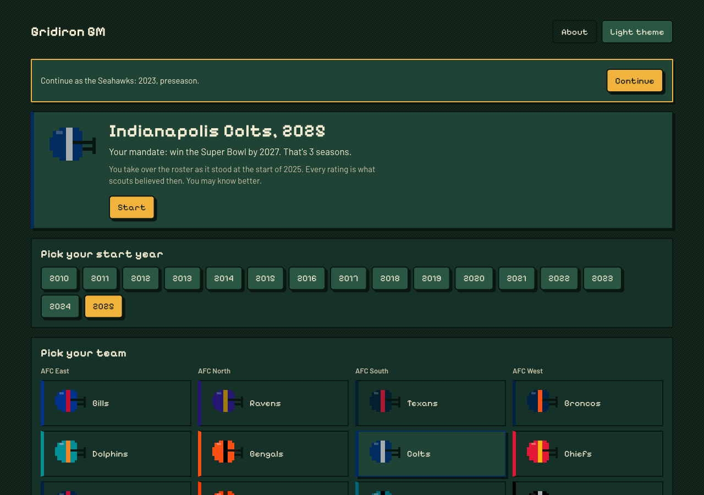
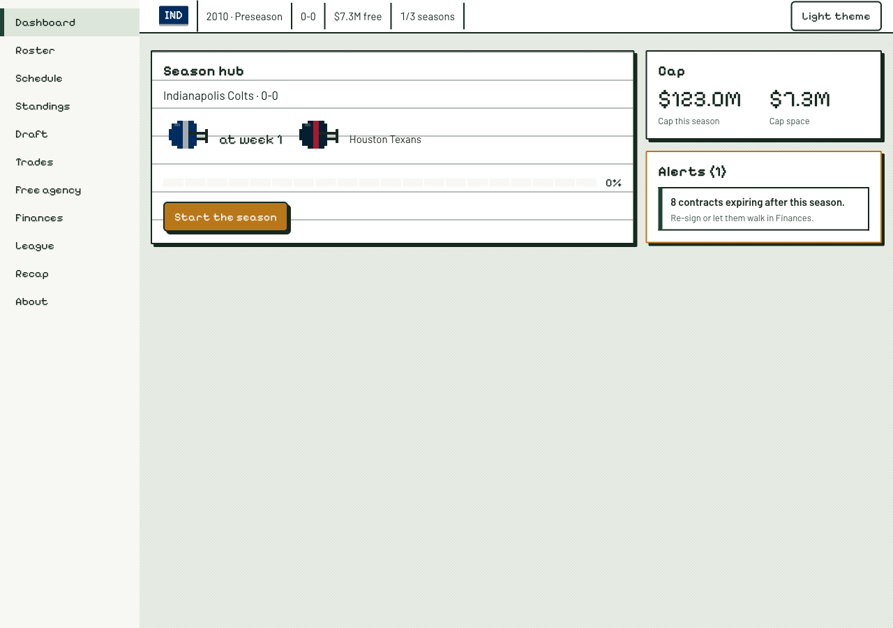
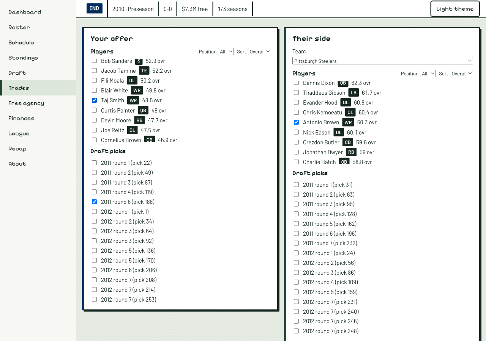
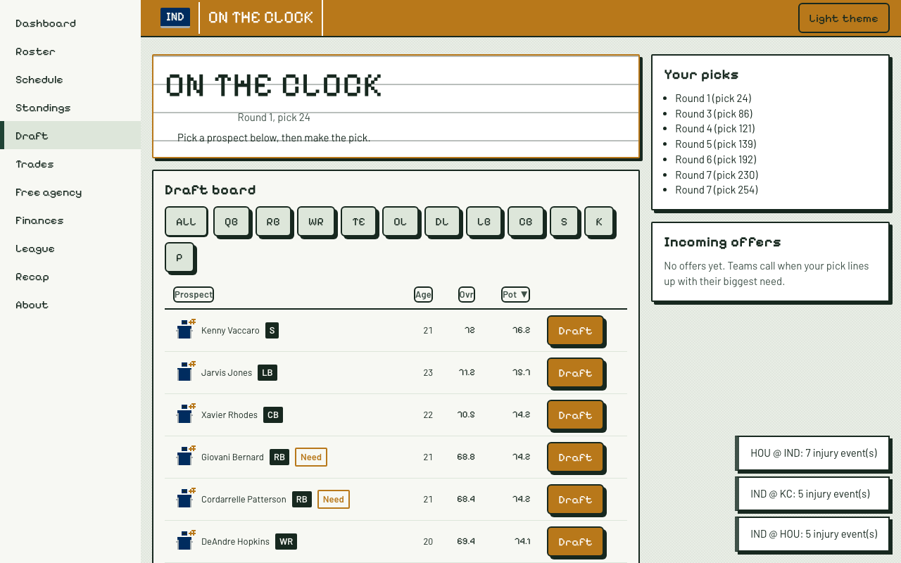
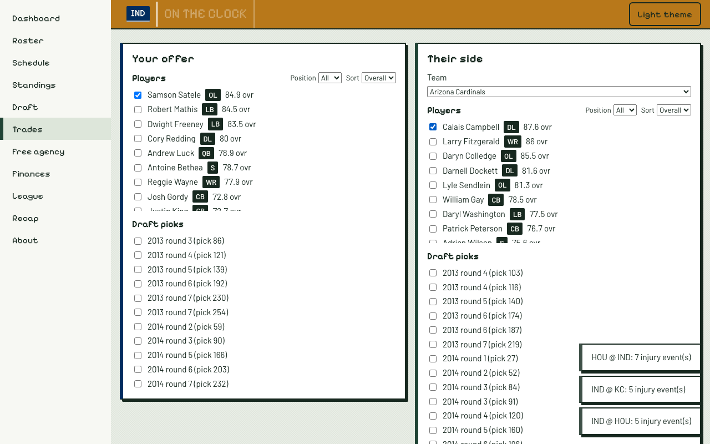
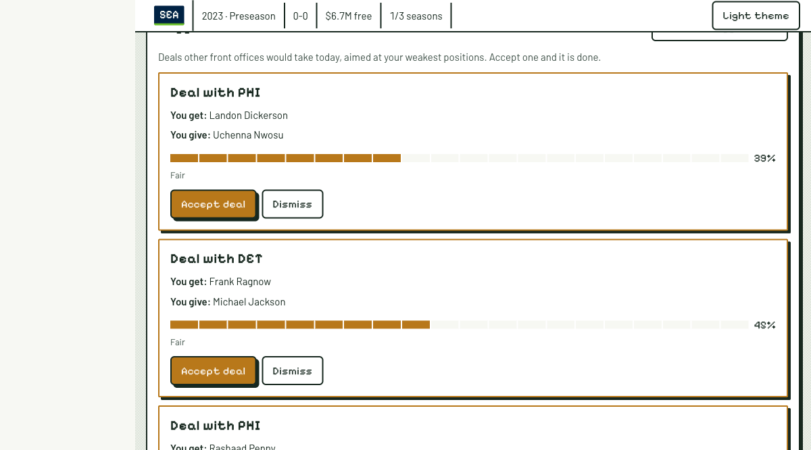
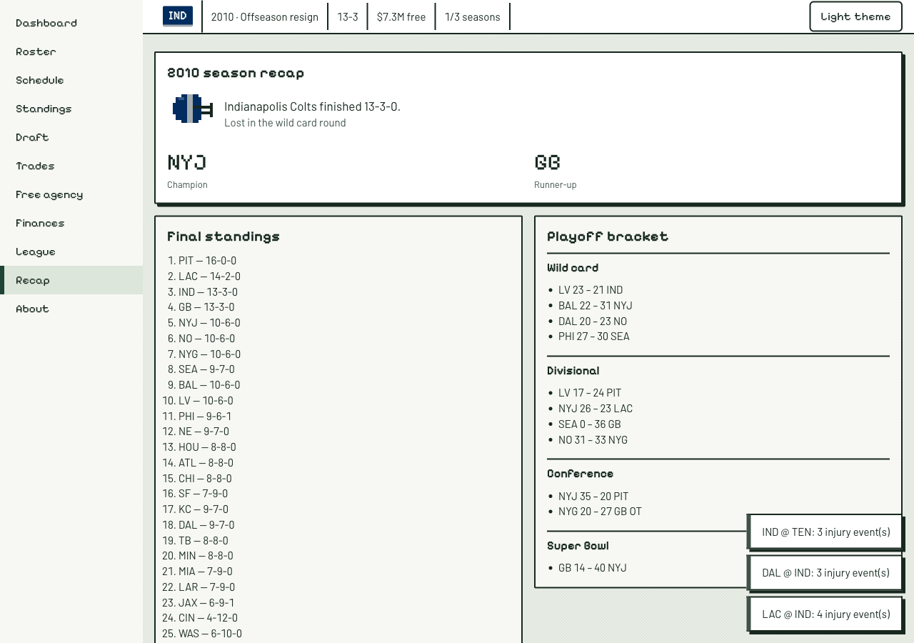
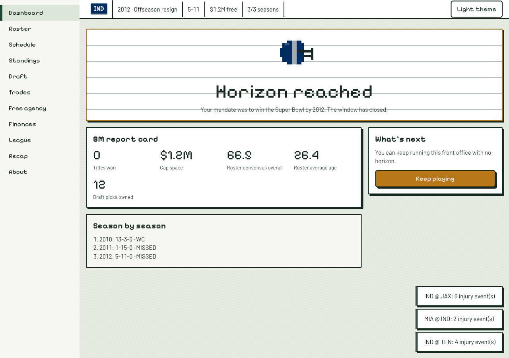

# Gridiron GM

A browser-based NFL general-manager simulation with a twist: you take over a real team in a real season
(2010 onward), and **you know how every player's career actually turned out**. Everyone else in the
league — every AI front office — only knows what the scouting consensus believed at the time.

> **Unofficial fan-made project. Not affiliated with or endorsed by the NFL, its teams, or the NFLPA.
> Data courtesy of [nflverse](https://github.com/nflverse) (CC BY 4.0).**

## Play it

**[danielportuondo.github.io/nfl-gm](https://danielportuondo.github.io/nfl-gm/)**

Pick a start year (2010–present), a team, and a horizon (1–10 seasons) — your mandate is to win the
Super Bowl before it runs out. Run the draft, sign free agents, make trades (or take one the Trade Center
suggests), and sim the season week by week. You never play the games; you make the calls. Saves live in your browser (IndexedDB) — close the
tab and pick up where you left off. Sixty seconds in: New Game → pick a year and team → Start → Draft
room, on the clock.

## The hindsight twist

Every rating shown in the UI — a player's overall, potential, everything on a scouting report — is a
**period-consensus grade**: what was publicly believed about that player at that point in the timeline.
Underneath, real players develop along their **actual real-world careers** (`state.truth`, hidden). The
draft AI, the trade AI, and free-agency bidding all rank players by consensus only, exactly as a real
front office would have at the time. You know that a late-round pick becomes a Hall of Famer; they don't.
That gap is the entire game. Once the simulated timeline runs past real NFL history, draft classes and
player development switch to a procedural model calibrated against 2010–present outcomes, so the game
keeps playing indefinitely with the same statistical texture.

## Architecture

```
app/                  Vite + React 19 + TypeScript (strict), client-only, no backend
  src/contracts/      Shared types, zod schemas, engine module interfaces
  src/engine/         Pure, deterministic game logic (league, sim, draft, trade, fa, lifecycle, history,
                       rng, persistence) — no React, no I/O, no wall-clock or Math.random
  src/store/          Zustand store bridging the engine to the UI; owns autosave/load
  src/ui/             Design system primitives (see docs/DESIGN.md)
  src/screens/        Game screens (Dashboard, Draft Room, Trade Center, Roster, ...)
pipeline/             Python 3.12 / pandas: ingests nflverse, builds ratings/consensus/outcome models,
                       exports JSON to app/public/data/
docs/                 HANDOFF.md (full brief), DATA_CONTRACT.md, ENGINE_CONTRACT.md, DESIGN.md,
                       DECISIONS.md
```

**Truth vs. scouting isolation** is the one rule the whole codebase is built to enforce: `LeagueState.truth`
and the `trajectories` table hold real career outcomes and may only be read by `engine/sim` (game
strength) and `engine/lifecycle` (season-to-season progression). `app/src/screens` and `app/src/ui` must
never see it — they read `state.scouting` (the public consensus) instead. This is enforced three ways:
ESLint's `no-restricted-imports`/`no-restricted-properties` rules block importing truth modules or
reading `.truth` from UI code (`app/eslint.config.js`), a dedicated `tests/truthIsolation.test.ts`
greps the built output for leaks, and the draft/trade/free-agency AIs are implemented to only ever
receive `ScoutingView` data, never `LeagueState.truth`, as a matter of interface design.

All engine randomness is seeded from `LeagueState.seed` plus a scope (season/week/game id) through
`engine/rng` — same seed, same league, every time. Engine functions are pure: they never mutate the
`LeagueState` passed in.

## The data pipeline

All real football data — rosters, draft classes, weekly stats, snap counts, depth charts, injuries,
combine results, contracts, schedules, and team names/colors — comes from the
[nflverse](https://github.com/nflverse) project (`nflverse-data`, `nfldata`) under CC BY 4.0. The
pipeline (`pipeline/gridiron_pipeline/{ingest,build,model,export}`) downloads and caches raw releases,
fits the ratings/aging/consensus/outcome models, and exports compact schema-valid JSON chunks to
`app/public/data/` — one file per season plus a handful of shared tables (teams, cap, aging/outcome
curves, injury model, and `trajectories.json`, the only cross-season file). Every exported file carries
an `attribution` field with the string below. Player headshots and team logos/wordmarks are dropped at
ingest and never shipped (see `DATA_LICENSE.md`).

```sh
cd pipeline && uv sync && make data   # idempotent: skips cached raw downloads
```

Data is size-budgeted for GitHub Pages (gzip): initial load ≤ 1.5 MB, any one season file ≤ 1 MB. CI
checks this on every push (`app/scripts/checkDataSize.ts`).

## Development

```sh
pnpm install && pnpm -r typecheck && pnpm -r test && pnpm -r lint   # app
pnpm gen:contracts                                                   # regenerate JSON schemas + ENGINE_CONTRACT.md
pnpm --filter app e2e                                                # Playwright smoke flow (builds + runs against a preview server)
pnpm --filter app headless -- --team IND --start 2012 --seasons 6   # multi-season integration harness
pnpm --filter app calibrate -- --season 2015                         # sim calibration against real results
cd pipeline && uv sync && uv run pytest -q && uv run ruff check .   # pipeline
cd pipeline && make data                                             # full data build (idempotent)
```

Testing is light but real: determinism (same seed → identical league), the truth-isolation lint/grep,
a calibration harness against real NFL outcomes, a headless multi-season run, a handful of targeted unit
tests per engine module, and the one Playwright E2E smoke flow above. No coverage targets.

## Known simplifications (v1)

- A real player's value in in-game season *S* is their real season-*S* value, regardless of which team
  they're actually on in this timeline (a QB you draft into a great offense performs as they really did).
- No comp picks once past real history; no practice squad; simplified salary cap (no restructures or
  void years); a single injury model across positions with position-based scaling; simplified playoff
  tiebreakers; post-history schedules generated by a simplified formula.
- Not in v1: coaching staff/schemes, morale or holdouts, animated play-by-play highlights, start years
  before 2010, detailed real contract structures, multiple-user leagues.

See `docs/HANDOFF.md` §8 for the full list and the v2 backlog.

## Screenshots

From the Phase 6 QA playthrough (IND, 2010 start, three-season horizon):










## Repository

| Path | What |
|---|---|
| `app/` | Vite + React + TypeScript client. Pure, deterministic engine under `app/src/engine`; screens under `app/src/screens`. Saves live in IndexedDB. |
| `pipeline/` | Python/pandas pipeline: ingests nflverse releases, fits ratings/consensus/outcome models, exports JSON chunks to `app/public/data`. |
| `docs/` | Handoff brief, contracts, design system, decision log. |

## Data attribution and license

Real football data is from the [nflverse](https://github.com/nflverse) project (`nflverse-data`,
`nfldata`) under [CC BY 4.0](https://creativecommons.org/licenses/by/4.0/). **Data courtesy of nflverse
(CC BY 4.0).** No player photographs, no official team logos or wordmarks, no data or code from other
games (see `DATA_LICENSE.md`). Code is MIT (`LICENSE`). Non-commercial: no ads, no payments.

**Unofficial fan-made project. Not affiliated with or endorsed by the NFL, its teams, or the NFLPA. Data
courtesy of [nflverse](https://github.com/nflverse) (CC BY 4.0).**
